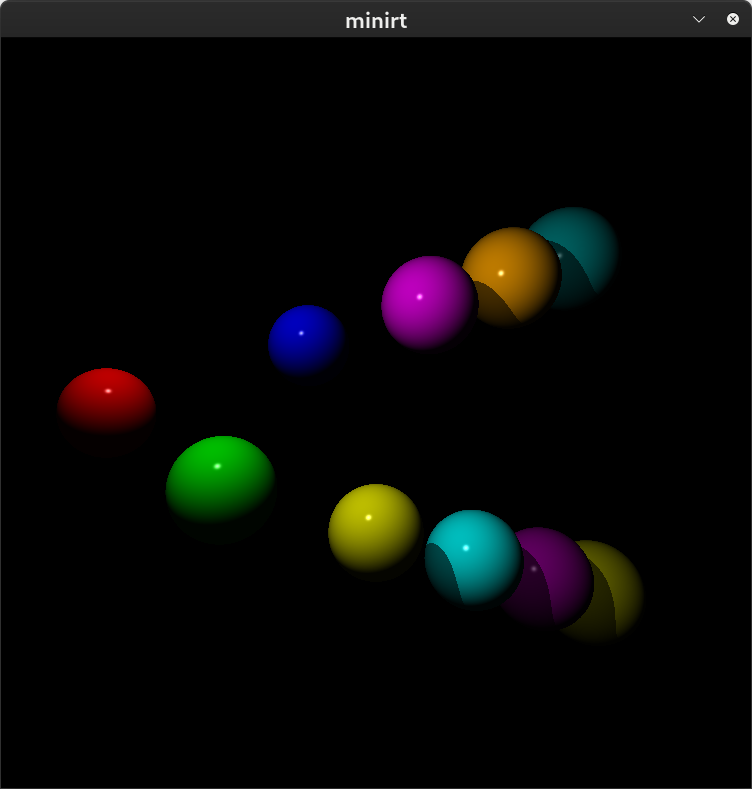
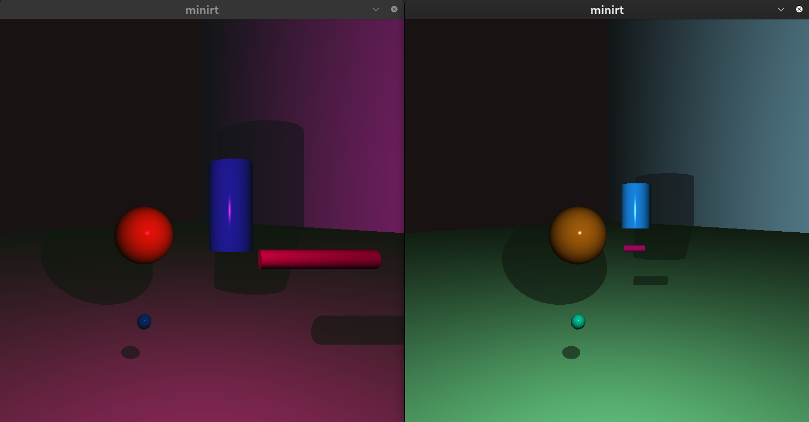

# 42-minirt

## About
This project is a ray tracing engine designed to render 3D scenes by simulating the behavior of light. It parses a scene configuration file to generate images containing geometric primitives like spheres, planes, and cylinders. The program handles light intersections, shadows, and multi-object depth using MiniLibX, an interface designed for the X-Window system.
To power the ray-object intersections and camera transformations, this project utilizes a custom-coded linear algebra library (`libla`). This engine manages all essential 3D transformations and vector mathematics.

<!--
## Getting started
### Prerequisites
### Installation
-->

<!--## Usage-->
<!--## Roadmap-->
<!--## Contributing-->
<!--## License-->
<!--## Contact-->
<!--## Aknowledgements-->

---
*42 is a coding school that emphasizes on project-based and peer-to-peer learning.*

*The project complies with the 42 norm. The latest norm can be found on the [42 repository](https://github.com/42School/norminette/tree/master/pdf)*.